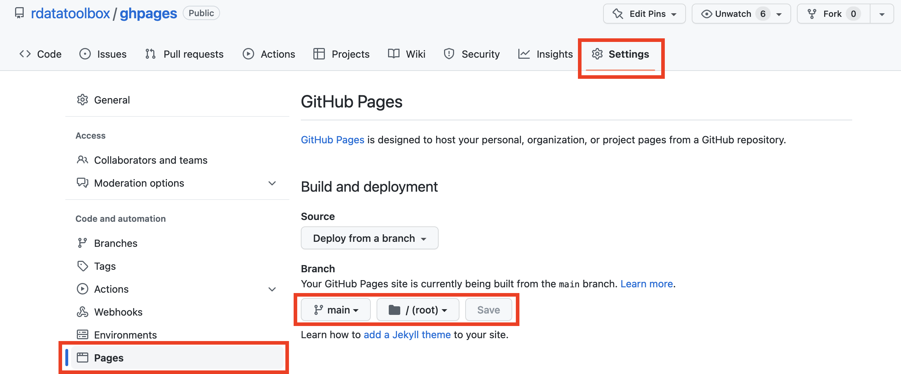

<!-- README.md is generated from README.Rmd. Please edit that file -->

# ghpages

<!-- badges: start -->

[](https://choosealicense.com/licenses/gpl-2.0/)
<!-- badges: end -->

Example to show how to deploy HTML files on GitHub Pages. Do not forget
to activates **GitHub Pages** in the repository settings as follow:



### Usage

Clone the repository, open R/RStudio and run:

``` r
source("make.R")
```

### Notes

- All required packages, listed in the `DESCRIPTION` file, will be
  installed (if necessary)
- All required packages and R functions will be loaded
- Some analyses listed in the `make.R` might take time
